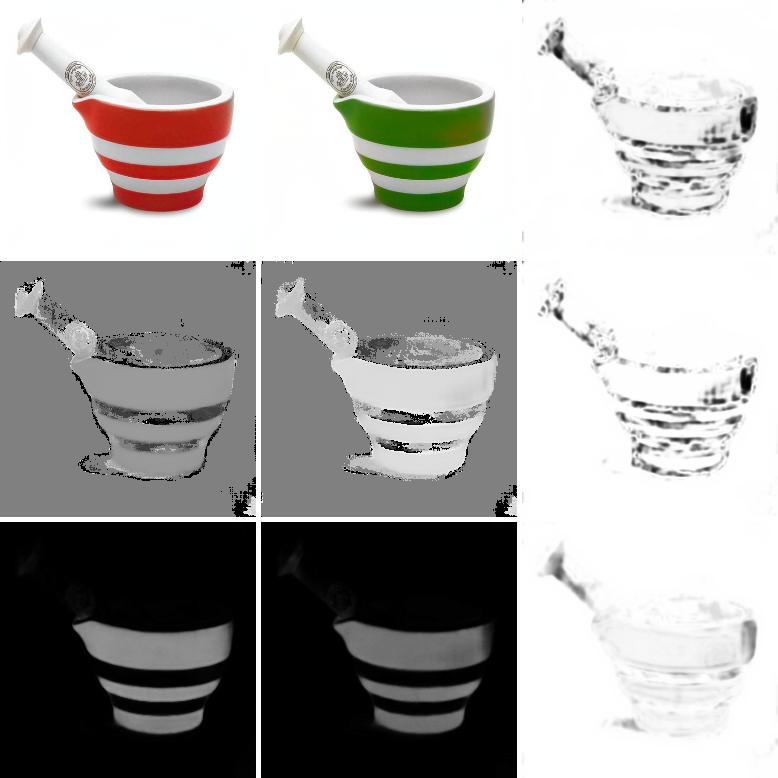

# SHSM

The SHSM directory is where the important functions are stored.  All other
files in this repository are for testing/demonstrating the functionality.
Our paper shows and discusses the results of these.

# Single Test
To do a single test of a ground-truth image against a colourised image, use
singleTest.py

usage:
```shell
python singleTest.py -g <ground_truth_image> -c <colourised_image>
```


This will print out the comparison result to the console and will also create
a map image showing where the images differ, as you see from the example below.
The map file will be called SSIM_SHSM_map and will be saved in the root directory.


If you don't specify your own images, it will default to using the Mortar and
Pestle images.




# Testing multiple colourisations against a single ground-truth.

To do this you should use the testRecolourisations.py program.

usage:
```shell
python testRecolourisations.py
```

This will use the folder called "recolour". In this folder is placed a
ground-truth image called GTP.png. There is also a folder of colourisations
called "colourisations". This contains all the colourisations that we want to
compare with our ground-truth image.

If you want to test your own you will need to rename your ground-truth image to
GTP.png but the images in the colourisations folder can be anything as long as
they are png files. To use jpg files you will simply have to modify the testRecolourisations.py file to reflect this.

This will output a csv file called psRecolourResults.csv which will contain
a row of results for each image in the colourisations folder.


# Testing SOTA colourisation algorithms.

To do this we used 20 images from the places dataset. Ideally we would choose more
but many of the SOTA systems we wanted to test require manually uploading a grey-scale
prior into a web interface one at a time and then downloading the resulting
colourisation. Despite the small number of images we found that there was still
a large variance in the results.

To try this yourself you will need to use the file testSOTA.py

usage:

```shell
python testSOTA.py
```

This will use the folder "./testImages/colourisationSystems/".
In this folder we have put the 20 ground-truth images in a folder called "groundTruth".
We have put the colourisations of the 20 images in a folder called "colourisations"
and we have a separate sub-folder under "colourisations" for each system that we
tested.
Note that the names of each image must be the same as that image in the "groundTruth"
folder. Because some systems output .jpg and some output .png, we have allowed for both.
Do keep in mind that the quality of compression used will effect the results.

To create your own grey-scale prior you can simply convert the colour ground-truth
images to the CIEL*a*b* space and use only the L-channel.
